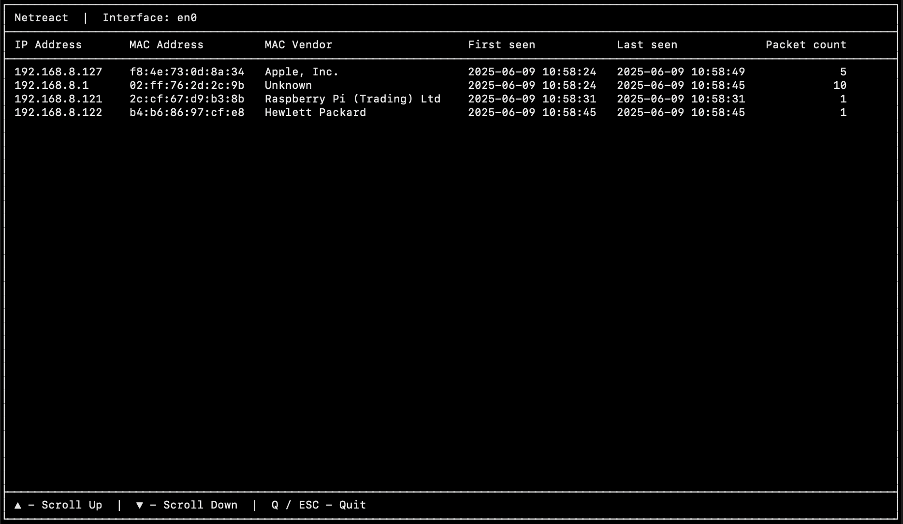

# Netreact

Passive ARP scanner with built-in support for generating event notifications. Inspired by other ARP tools and some real-life events in my
home network.

[](https://github.com/ipastusi/netreact/actions/workflows/ci.yml)
[](https://github.com/ipastusi/netreact/actions/workflows/codeql-analysis.yml)



## Overview

Once started and depending on the configuration, Netreact will passively listen to ARP traffic, and:

- Populate the log file using JSON Lines format.
- Update the user interface every time a new packet is received, unless disabled.
- Create event files in JSON format, if enabled.

## Quick start guide

Build:

```
go build
```

If the build fails, you may need to install `libpcap-dev` or similar, depending on your Linux distribution.

Help:

```
./netreact -h
Usage of ./netreact:
  -c string
    	YAML config file (default none)
  -i string
    	interface name, e.g. eth0 (mandatory)
  -l string
    	log file (default "netreact.log")
  -p	put the interface in promiscuous mode (default false)
  -s string
    	state file (default none)
```

If you won't provide the `-c` flag, Netreact will run in a textual user interface mode with limited configurability, and no event files will
get generated. This way you can passively listen to the ARP traffic on your network, in real time. The `-s` flag allows you to specify the
name of a JSON state file to / from which to save / load data. It allows you to persist the collected data between executions. Examples:

```
./netreact -i eth0
./netreact -i eth0 -s nrstate.json
./netreact -i eth0 -c netreact.yaml
```

## YAML config

Use the `-c` flag for full configurability. Everything that can be specified using CLI arguments (and much more) can be also specified
through the YAML config. CLI arguments take precedence over YAML. Sample YAML config:

```yaml
# overrides -i flag
interface: eth0
# overrides -l flag
log: netreact.log
# overrides -p flag
promiscuousMode: true
# overrides -s flag
stateFile: nrstate.json
# BPF filter, e.g. "arp and src host not 0.0.0.0" (default "arp")
bpfFilter: arp
# disable textual user interface
ui: true
# event generation configuration
events:
  # directory where to store the event files, relative to the working directory, if provided (default working directory)
  directory: out
  # auto cleanup generated event files after n seconds (default 0, disabled)
  autoCleanupDelaySec: 0
  # expected CIDR range (default "0.0.0.0/0")
  expectedCidrRange: 0.0.0.0/0
  exclude:
    # file with excluded IP addresses
    ipFile: ip.txt
    # file with excluded MAC addresses
    macFile: mac.txt
    # file with excluded IP-MAC address pairs
    ipMacFile: ip_mac.txt
  # generated every time a new ARP packet is received
  packet:
    # any ARP packet, event code 100
    any: false
    # ARP packet from a link-local address (169.254.0.0/16), event code 101
    newLinkLocalUnicast: false
    # ARP packet from unspecified address (0.0.0.0), event code 102
    newUnspecified: false
    # ARP packet from broadcast address (255.255.255.255), event code 103
    newBroadcast: false
    # ARP packet from unexpected address (see expectedCidrRange above), other than 169.254.0.0/16, 0.0.0.0 or 255.255.255.255, event code 104
    newUnexpected: false
    # ARP packet with the same MAC but different IP address than recorded previously, event code 105
    newIpForMac: false
    # ARP packet with the same IP but different MAC address than recorded previously, event code 106
    newMacForIp: false
  # same as above, but generated only once per host (a host is identified by an IP-MAC pair combination)
  host:
    # event code 200
    any: false
    # event code 201
    newLinkLocalUnicast: false
    # event code 202
    newUnspecified: false
    # event code 203
    newBroadcast: false
    # event code 204
    newUnexpected: false
    # event code 205
    newIpForMac: false
    # event code 206
    newMacForIp: false
```

## MAC vendor lookup

Netreact ships with an embedded MAC OUI database for MAC vendor lookup, based on publicly available MA-L data (see [oui.txt](oui/oui.txt)).
No external files or online services are required at runtime.

## Event files

See the documentation for the YAML config for the types of events supported by Netreact. Generated file names will match
`netreact-<unix_timestamp>-<event_code>.json` pattern, e.g. `netreact-1747995770259-100.json`. Event codes are used in generated filenames
only.

Sample packet-level event file:

```json
{
  "eventType": "NEW_PACKET",
  "ip": "192.168.8.100",
  "mac": "f8:4e:73:2d:1c:8a",
  "firstTs": 1749464243156,
  "ts": 1749464246164,
  "count": 5,
  "macVendor": "Apple, Inc.",
  "expectedCidrRange": "0.0.0.0/0"
}
```

Sample host-level event file:

```json
{
  "eventType": "NEW_HOST",
  "ip": "192.168.8.100",
  "mac": "f8:4e:73:2d:1c:8a",
  "ts": 1749464246164,
  "macVendor": "Apple, Inc.",
  "expectedCidrRange": "0.0.0.0/0"
}
```

Event details will depend on the particular event type:

- `eventType` - One of the supported event types.
- `ip` - ARP packet source IP address.
- `mac` - ARP packet source MAC address.
- `firstTs` - Unix timestamp of when this IP-MAC combination was first seen, in milliseconds.
- `ts` - Unix timestamp of when the ARP packet was received, in milliseconds.
- `count` - Number of packets with this IP-MAC combination seen so far.
- `macVendor` - Vendor name for the MAC address OUI. `Unknown` if not found.
- `expectedCidrRange` - Expected CIDR range.
- `otherIps` - Other IP addresses recorded previously for this MAC.
- `otherMacs` - Other MAC addresses recorded previously for this IP.

## FAQ

### How can I handle events generated by Netreact?

Event files generated by Netreact offer you the ability to trigger custom responses to the ARP events. You can implement arbitrary event
file detection mechanism and response logic.

On Linux you might want to use `inotifywait` to detect event file creation:

```
inotifywait -qme close_write out/ --format %w%f | parallel -u echo
out/netreact-1747995770259-100.json
out/netreact-1747995770270-100.json
out/netreact-1747995770292-100.json
```

On macOS you might want to use `fswatch`:

```
fswatch --event Created out/ | xargs -n 1 -I _ echo _
/path/to/netreact/out/netreact-1747995770294-100.json
/path/to/netreact/out/netreact-1747995770336-100.json
/path/to/netreact/out/netreact-1747995771602-100.json
```

### Why automatic event file cleanup on macOS makes fswatch incorrectly detect file deletion as file creation?

If you are using Netreact on macOS with enabled automatic cleanup of generated event files, and `fswatch` incorrectly reports file deletion
as `Created` events, you might want to increase the cleanup delay to a higher value, e.g. 30 seconds. See
[fswatch #144](https://github.com/emcrisostomo/fswatch/issues/144#issuecomment-264135666).

### Netreact doesn't detect any ARP traffic, unless I start tcpdump on the same machine. Why is that?

By default, `tcpdump` puts the interface into promiscuous mode. If this makes Netreact start detecting ARP traffic, you will likely want to
configure Netreact to put the interface into promiscuous mode without having to use `tcpdump`.

### How can I leave Netreact running on the remote host, disconnect, and reconnect to that remote session again?

You can use the `screen` tool:

```
# connect to the remote host where you want to run Netreact
ssh ...

# run a screen command, this is what will give you persistence between reconnections
screen

# start Netreact
sudo ./netreact ...

# detach from the screen session
CTRL+A, D

# disconnect from the remote host
exit

# reconnect to the remote host
ssh ...

# reconnect to your screen session
screen -r

# exit Netreact, if you want to
ESC

# end your screen session
CTRL+D

# disconnect from the remote host again
exit
```
